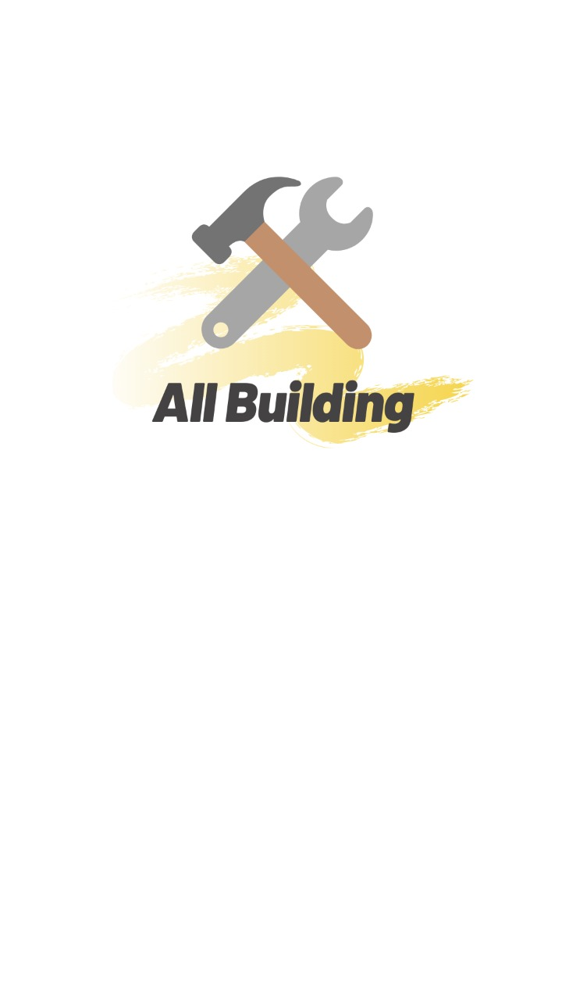
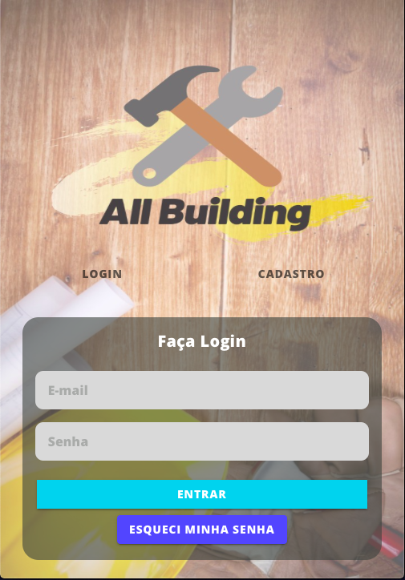
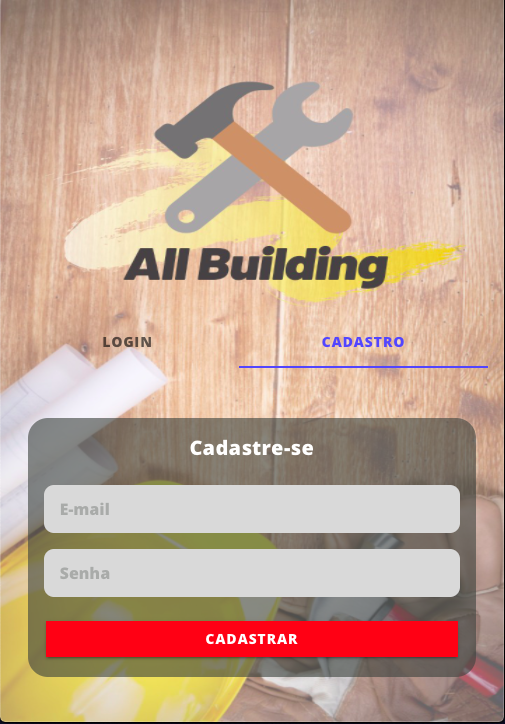
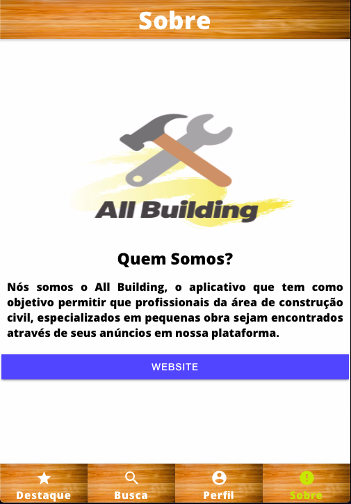

#Projeto All Building

Data início: 23/10/2019
Data término: 11/12/2019

Turma 2018.1 - Senac Bonsucesso

 

Equipe de Desenvolvimento:

- Antonio Lima
- Cícero Marlon
- Flávius Caio
- Igor Lopes
- Victor Manuel

Descrição: Aplicativo voltado para divulgação
de profissionais da área de construção civil.

<!-- Login -->

 

<!-- Cadastro -->

 

<!-- Redefinir -->

 

<!-- Destaque -->

 

<!-- Busca -->

 

<!-- Perfil -->

 

<!-- Sobre -->

 

